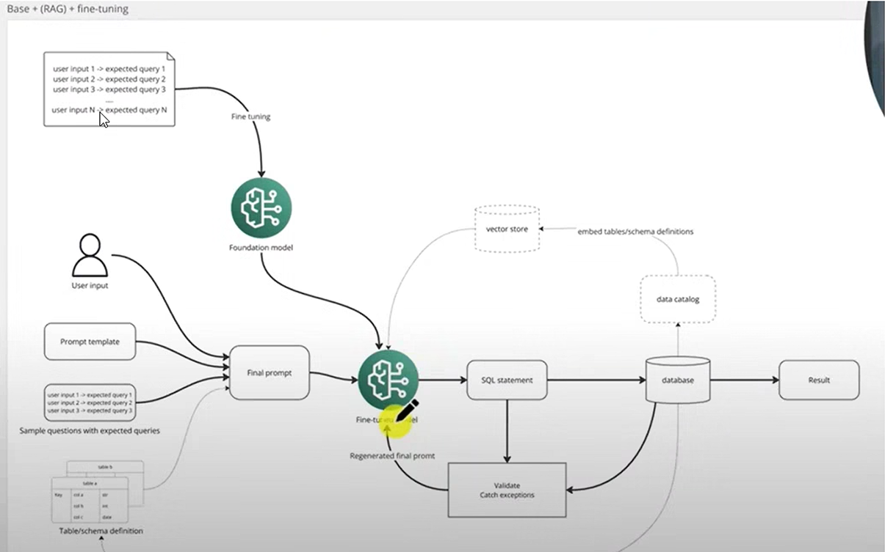

# DSCI-2025-TEAM-A

## Message Traffic Summarization

Team members: Christian Reza, Christian Young, Spencer Thomas

---

# Meeting Minutes

## 5 Feb 2025

**How do we do EDA work on data that we generate ourselves?**

- For the assignment, we can use other datasets just for the assignments and present that.

**Need paper we are studying related to our project and link in MS Teams (Each person needs a unique paper).**

- Message summarization techniques (not too heavy though.)
  - Create one or two slides based on the paper we are reading.
- Some topics we may want to look for are about the models we can use and if we are able to add layers to the models.
  - Look into how we can add layers to these models as well.

**Do we need the messages at all?**

- Would it be easier to just generate data for the tables and use that? Probably, since we are not building message validation model, just a summarization one.
- Shouldn't have to worry about processing rules for the data (message sequences.)
  - Models understanding an API schema rather than a table schema (this may be big picture, not for the semester, though.)
- **Skip messages, instead create a schema for the data**

**Model Mayhem**

- What category of model do can we use?
  - Question/Answer model or Table Question Answering Model (Table Q&A model)
    - How do we create data to train these kinds of models.
    - We want a model that is interactive with the user.
  - Table Q&A Models can query a table and get the results, so we need a schema and not messages.
  - Q&A Model do not need a database schema to be able to get answers.
  - The type of model we use will most likely affect the kind of schema we use.
- **We don't have a dataset, creating one will be very time consuming. Are there any Q&A datasets available that we can use instead?**
  - Dig around Hugging Face datasets
    - https://huggingface.co/datasets?task_categories=task_categories:table-question-answering&sort=trending
    - https://huggingface.co/datasets?task_categories=task_categories:question-answering&sort=trending
    - Text-to-SQL model
      - Are there pre-trained models for that, if so, can we take two models and merge them together to create what we want? (That would be nice, would need do transfer learning to merge them).
        - Transfer learning could require a new dataset and PyTorch to add to the last layer.
- Start with the the most simple model we can find first and then expand little-by-little.
  - **_Be realistic!_**

**Action Items**

- Articles picked out (something about models or transfer learning). - **@Christian Reza @Christian Young @Spencer Thomas**
- Put together project presentation. (**DUE 12 FEB**)
  - Outline of topics we want to present. - **@Christian Young**
    - Member introductions
    - Model types (Text-to-SQL, Q&A, Table Q&A, etc.)
    - etc.
- Each pick out a model and investigate how it works and take notes on it. - **@Christian Reza @Christian Young @Spencer Thomas**
  - Put notes in a file in Teams. - **@Spencer Thomas**

## 16 Feb 2025

**Thoughts and feelings**

- Christian Young has been doing general research on our project and the concept of text-to-sql
  - Found a flow chart that feels expresses what we failed to express in our presentation.
    - 
  - Vector store seems like something we need a better understanding of - seems like its more flexible than directly querying the table.
- Spencer has asked about the EDA assignment - since we don't really have a dataset right now, following is the response from Lochana:
  > Spencer Thomas: If you would like to perform an EDA for a different data set (i.e., tabular), all three of you may do that in the same data set. The reason I encourage you to analyze your LLM data set or close enough data set from the internet is that it will save you time in the end. The EDA submission and presentation itself takes 2 weeks. Even at the end, you also have to work some sort of EDA for your LLM data (once you have it) before applying to the models.
  > As I mentioned to Christian Young, you don't really have to do "EDA" for the LLM data. Maybe do a preliminary level model using an available LLM data set so that students in other teams and I know what your project direction is. I am more than happy to talk in a Zoom call if you have further clarifications.
- Would we be able to use the spider dataset as our data for our project?
  - Its a database schema [expressed as a CSV](https://github.com/jkkummerfeld/text2sql-data/blob/master/data/spider-schema.csv), it also has actual [examples of natural language queries and the transformed SQL query](https://raw.githubusercontent.com/jkkummerfeld/text2sql-data/refs/heads/master/data/spider.json) - so it can be the actual training data we would use to transform the model.
    - _would this be too lazy?_
    - There is a [script](https://github.com/jkkummerfeld/text2sql-data/blob/master/tools/spider_schema_to_sqlite.py) in the repo that turns the CSV into a sqllite database.
- What is a T5 model?
  - Essentially, its Text-to-text-transfer-transformer
    - QA models
    - Translation models (languages)
  - Study a T5 model and find out how we can fine-tune it.
- Do we need data cleaning for our project?
  - It doesn't seem like we do, since we are not really using a text dataset, if we do it, we'd use it on the natural language queries; what we are using to train the model - _but it doesn't seem like the models need that to be trained._
- Our assignment isn't really EDA, its more of a spike to learn about the technology and how we can achieve our goals.
- Does this make our project too easy, just transfer learning and we're done? **What are we doing that hasn't been done?**
  - What we want to prove is that we can take **ANY** dataset, apply transfer learning against a model and prove that it can do what we want it to.
    - If we're using a dataset, we shouldn't be using a model trained off it, we want to be able to prove we can take a T5 model and fine tune it to domain-specific data.

**What are we doing for the EDA assignment?**

- ~~Use the spider dataset and do EDA on it and start looking into a T5 model?~~
- **Analyze the spider dataset schema and try to populate a database and get a text-to-sql model working**
  - Take a pre-existing dataset ([Spider 1.0](https://www.kaggle.com/datasets/jeromeblanchet/yale-universitys-spider-10-nlp-dataset/code)) and apply transfer learning to a T5 model and show what we learned and what proved to be a problem.
    - ~~OR create our own _small_ schema, like 5 tables and populate manually and do a small scale test of transfer learning?~~

## 23 Feb 2025

**EDA Presentation**

- Christian _Young_ is still in the process of getting something funtional - working on the modeling portion.
  - Focusing only on the `Player` table as well
- Christian _Reza_ is working on getting the TAPAS model out of the box and testing it against the soccer_1 dataset, to see if it is already trained on it.
  - Hopefully it is not and we can prove that the fine tuning/transfer learning is working

**Presentation idea** - present it as an architechiural comparison - different approaches of text-to-sql vs TAPAS' method of using answer coordinates.

- **TIMING IS GRADED!**
- Data flow chart to give more context to our project
- Talk about the challenges of:
  - generating new data (Young)
  - training the a pre-existing model (Reza)
- Data pre-processing
  - For each approach, talk about:
    - Tokenization of data
    - Creation of training data to feed model and getting answer coordinates (SQA)
- Overview of data
  - `Player` table of `soccer_1` data from ([Spider 1.0](https://www.kaggle.com/datasets/jeromeblanchet/yale-universitys-spider-10-nlp-dataset/code)) on kaggle
    - This is what Young and Reza focused on for their EDA assignment
- Hopefully one of us can get something working before the presentation so that we can talk about more concrete results
- Lessons learned on using models
  - Checking the model's abilities off the shelf before trying to mess with fine tuning it
- Talk about next steps - review the pros and cons and use that to show what may be the preferable route for our project.

---

## 30 Mar 2025

- Discussed mid-semester assignments
- Built outline on mid-semester presentation
- Talked more on the next steps and what we want to get done for the final presentation

---

## 6 Apr 2025

### Mapping out the days for the final project. (Presenting on the 30th)

- We want to get the work done and make sure **everyone** has a comparable understanding of the project.

#### What do we need to do still

- Fine-tuning the model w/ the right training data
- Develop a method of testing the accuracy of the model
  - I believe to do this, we need more testing data so that we can do a train/test split
  - Instead of testing the accuracy of the model by matching a target query, compare the results of the query. (i.e. instead of comparing the SQL query, compare the retrieved results).
- RAG improvement for the model, making it more dynamic
- Deployment strategy (if time permits) - we don't have experience on it
  - Plotly app? https://plotly.com/examples/dashboards/

#### Divide and conquer

- One focus on RAG - **Spencer** and **Young**
- One focus on fine-tuning/data generation - **Spencer** and **Reza**
- One focus on deployment strategy - **Young**

#### Misc.

- Looking for a new dataset that has valid relationships already created (soccer_1 data had broken links between tables)
  - Looking at potentially using the cars_1 spider data since it looks like it has good relationships defined
- Using this meeting time to get everyone updated on what we did on the mid-semester assignment

#### Goals for Divide and Conquer

| Goal                                      | Due Date     |
| :---------------------------------------- | :----------- |
| Status update                             | **April 13** |
| Finish technical work                     | **April 20** |
| Give us 3 days to create the presentation | **April 27** |
| Finish final presentation                 | **April 30** |
| Finish final presentation (individual)    | **May 7**    |

---

## 13 Apr 2025

- Status update from last meeting

### Christian Young

- Looking into the deployment strategy
- Thinking its still possible to get an app where the user can enter a question and get the results back from the model
- MVP might be creating the API to hit the model hosted on a server (can be hit w/ CURL or something)
  - We can ask if this is acceptable, since we are not showing how the user is going to interact w/ the model, but we would be showing the developer how to talk to it via an API.
  - MVP would be better since we can focus more on the polish of the model to handle more cases and show off its potential
- What is the requirement vs what is nice-to-have for the UI/UX.

### Christian Reza

- Has a much better understanding on how to train we can train the model to be able to handle more cases that aren't in the training data

### Spencer Thomas

- N/A

## Misc.

- Goal is to get technical work done by the 20th and the following week we will tie it all together and cleaned up and get the git repo set-up as we want and prepped for the presentation.
- Check that the API route for is acceptable.

---

## 20 Apr 2025

- Status update from last meeting

### Christian Young

- Has a working proof of concept for deployment strategy
  - Proof of concept hard codes the SQL response that our model generates
  - Has API deployed to AWS EC2 instance and able to make requests against it
  - Just need to replace contents of API with actual calls to our model

### Christian Reza

- Refinements to fine-tuning on model
  - Re-balanced the training data a bit and it seems to be able to do it a little better now
  - Adjusted the learning rate a bit
  - Training it on his machine (w/o cuda cores) takes around 7:30

### Spencer Thomas

- N/A

## Action Items.

- String together our application & deploy
- Research & calculate suitable metrics for our model
  - Correctness, semantics similarity and hallucination are common metrics applied to LLMs
  - May be better to use compare expected sql to outputted sql instead of retrieved data values
- Organize our MS teams and Git directory structure

---

## 27 Apr 2025

### Prep for final presentation updates

* Reza was able to get some metrics reported from the fine-tuned model to present in the final presentation
* Spencer is creating some more training data for our model to hopefully improve the metrics we are pulling
* Young has a working example of RAG with out new dataset (cars_1)
  * Was able to remote Stop-Words which would have inflated *k* sometimes it is 1 or 2 higher
  * Needs some fixing on the regex on parsing the tables to pass the schema to the model w/ the question
  * Has cleaned up the noteboook and should now be much more easily integrated w/ other playbooks

### Presentation Outline

* Fine-tuning
  * New dataset with rich relationships
  * Talk about the kinds of things we thought about when making the training data
    * Issues with **Catastrophic Forgetting**
* Metrics (At the end of fine-tuning)
  * Talk about accuracy and how it may not be super representitive, i.e. there are several ways to write a SQL query to get the right answer, so exact matches aren't the only thing that matters.
  * Talk about what we can do to improve the metrics
* RAG
  * We are able to get the right target columns to pass to the model, maybe 1 or 2 extra columns (more is better in this case)
* Deployment Strategy
  * We are picturing this being a pretty short section
* Next Steps
  * Talk about **Transfer Learning** to give a full sentence answer back to the user and be able to generate human readable reports for complex questions
  * Develop an **UI** w/ our deployment strategy; we have an API

### Goals

* Have slides done to meet w/ Professor by Tuesday (4/29)

#### After Wednesday (Have done by Saturday May 3)

* Coordinate to get tfinal project deployed
* Add a README about general overview of our project - high level
* Reoganize repo according to [this link](https://resources.experfy.com/bigdata-cloud/manage-your-data-science-project-structure-in-early-stage/)